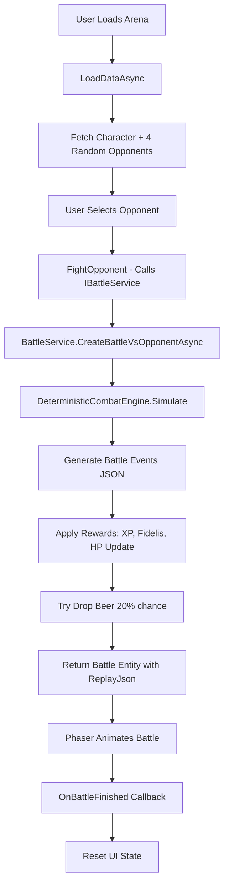

# 🎮 Stage Mode Implementation Guide - My Tuno

**Created:** 2025-02-01  
**Purpose:** Complete architecture analysis for implementing progressive Stage Mode feature

---

## 📋 Table of Contents
1. [Current Arena Implementation](#1-current-arena-implementation)
2. [Inventory System](#2-inventory-system)
3. [InstrumentType Enum](#3-instrumenttype-enum)
4. [Scaling Configuration](#4-scaling-configuration)
5. [Character & Equipment](#5-character--equipment)
6. [Database Structure](#6-database-structure)
7. [Recommended Stage Mode Architecture](#7-recommended-stage-mode-architecture)

---

## 1. Current Arena Implementation

### 📍 File Location
```
/src/RTUB.Web/Pages/MyTuno/Arena.razor
```

### 🏗️ Structure
- **Route:** `/my-tuno/arena`
- **Render Mode:** InteractiveServer (Blazor Server-Side)
- **Navigation:** Back button navigates to `/my-tuno`

### ⚔️ Battle Flow



### 🎯 Key Components

**1. Opponent Selection**
```csharp
// CharacterRepository.cs - Lines 50-64
public async Task<List<Character>> GetRandomOpponentsAsync(int count, int excludeCharacterId)
{
    var memberCharacters = await GetMemberCharactersAsync(excludeCharacterId);
    return memberCharacters.OrderBy(_ => Guid.NewGuid()).Take(count).ToList();
}
```

**2. Battle Initialization**
```csharp
// Arena.razor - FightOpponent method
private async Task FightOpponent(Character opponent)
{
    selectedOpponent = opponent;
    currentBattle = await BattleService.CreateBattleVsOpponentAsync(
        character!.Id, 
        opponent.Id
    );
    // Triggers Phaser animation via JS interop
}
```

**3. Combat Engine**
```csharp
// DeterministicCombatEngine.cs
// - Seeded RNG for replay reproducibility
// - Turn-based combat (speed determines order)
// - Damage = Power * Variance(0.8-1.2), doubled if crit
// - Max 50 rounds
// - Outputs JSON events: Attack, HPUpdate, KO, Victory, Draw
```

**4. Reward System**
```csharp
// BattleService.cs - Lines 152-174
var battleRewards = _config.GetSection("MyTunoScaling:BattleRewards").Get<BattleRewards>();

if (result.Outcome == BattleOutcome.AttackerWon)
{
    xpReward = 50; // Fixed 50 XP
    fidelisReward = battleRewards.WinReward; // 10 Fidelis
}
else if (result.Outcome == BattleOutcome.DefenderWon)
{
    xpReward = 0;
    fidelisReward = battleRewards.LossReward; // 5 Fidelis
}
else // Draw
{
    xpReward = 25; // Half of win
    fidelisReward = battleRewards.DrawReward; // 7.5 Fidelis
}

// Update character
attacker.AddXP(xpReward);
attacker.AddFidelis(fidelisReward); // Updates ApplicationUser.FidelisBalance
```

**5. Beer Drop System**
```csharp
// BattleService.cs - Lines 239-259
private async Task TryDropBeerAsync(string userId, int seed)
{
    var random = new Random(seed);
    var roll = random.NextDouble();
    
    if (roll < MyTunoScaling.BeerDropChance) // 0.2 = 20%
    {
        await _inventoryRepository.AddItemAsync(userId, InventoryItemType.Beer, 1);
    }
}
```

### 🎨 UI Features
- **Opponent Grid:** 4 opponents displayed with stats preview
- **Battle Animation:** Phaser game engine (800x500px)
- **Speed Controls:** 1x, 1.5x, 2x animation speed
- **Audio Toggle:** Battle sound effects
- **Battle History:** Paginated table showing past battles
- **Refresh Opponents:** New random set each page load

---

## 2. Inventory System

### 📦 InventoryItem Entity
**Location:** `/src/RTUB.Core/Entities/InventoryItem.cs`

```csharp
public class InventoryItem : BaseEntity
{
    [Required]
    public string UserId { get; set; }
    
    [Required]
    public InventoryItemType Type { get; set; }
    
    [Required]
    public int Quantity { get; set; }
    
    // Navigation
    public virtual ApplicationUser User { get; set; }
    
    // Factory Method
    public static InventoryItem Create(string userId, InventoryItemType type, int quantity)
    {
        if (quantity <= 0)
            throw new ArgumentException("Quantity must be greater than 0");
        
        return new InventoryItem 
        { 
            UserId = userId, 
            Type = type, 
            Quantity = quantity 
        };
    }
    
    // Business Logic
    public void AddQuantity(int amount)
    {
        if (amount <= 0)
            throw new ArgumentException("Amount must be greater than 0");
        Quantity += amount;
    }
    
    public bool ConsumeQuantity(int amount)
    {
        if (amount <= 0 || amount > Quantity)
            return false;
        
        Quantity -= amount;
        return true;
    }
}
```

### 🍺 InventoryItemType Enum
**Location:** `/src/RTUB.Core/Enums/InventoryItemType.cs`

```csharp
public enum InventoryItemType
{
    Beer = 1  // Currently only item type
}
```

**⚠️ Note:** Stage Mode will need to extend this enum for new item types (e.g., Instruments).

### 🔧 InventoryRepository
**Location:** `/src/RTUB.Application/Repositories/InventoryRepository.cs`

```csharp
public class InventoryRepository : Repository<InventoryItem>, IInventoryRepository
{
    // Get specific item type for user
    public async Task<InventoryItem?> GetItemAsync(string userId, InventoryItemType type)
    {
        return await _context.InventoryItems
            .FirstOrDefaultAsync(i => i.UserId == userId && i.Type == type);
    }
    
    // Add or update item quantity
    public async Task AddItemAsync(string userId, InventoryItemType type, int quantity)
    {
        var item = await GetItemAsync(userId, type);
        if (item == null)
        {
            item = InventoryItem.Create(userId, type, quantity);
            await _context.InventoryItems.AddAsync(item);
        }
        else
        {
            item.AddQuantity(quantity);
        }
        await _context.SaveChangesAsync();
    }
    
    // Consume item (validates quantity)
    public async Task<bool> ConsumeItemAsync(string userId, InventoryItemType type, int quantity)
    {
        var item = await GetItemAsync(userId, type);
        if (item == null || !item.ConsumeQuantity(quantity))
            return false;
        
        if (item.Quantity == 0)
            _context.InventoryItems.Remove(item);
        
        await _context.SaveChangesAsync();
        return true;
    }
    
    // Get all items for user
    public async Task<List<InventoryItem>> GetUserInventoryAsync(string userId)
    {
        return await _context.InventoryItems
            .Where(i => i.UserId == userId)
            .ToListAsync();
    }
}
```

### 💊 InventoryService (Beer Healing)
**Location:** `/src/RTUB.Application/Services/InventoryService.cs`

```csharp
public async Task<(bool Success, int HealedAmount, string Message)> UseBeerAsync(
    string userId, 
    CancellationToken cancellationToken = default)
{
    var character = await _characterRepository.GetByUserIdAsync(userId);
    if (character == null)
        return (false, 0, "Personagem não encontrado.");
    
    // Check beer quantity
    var beerQuantity = await GetBeerQuantityAsync(userId, cancellationToken);
    if (beerQuantity == 0)
        return (false, 0, "Não tens cerveja!");
    
    // Calculate healing (25% of TotalHP)
    int currentHp = character.CurrentHP ?? character.TotalHP;
    int maxHp = character.TotalHP;
    
    if (currentHp >= maxHp)
        return (false, 0, "HP já está no máximo!");
    
    int healAmount = (int)(maxHp * 0.25); // 25% heal
    int newHp = Math.Min(currentHp + healAmount, maxHp);
    int actualHealed = newHp - currentHp;
    
    // Consume beer
    var consumed = await _inventoryRepository.ConsumeItemAsync(
        userId, 
        InventoryItemType.Beer, 
        1
    );
    
    if (!consumed)
        return (false, 0, "Erro ao consumir cerveja.");
    
    // Update character HP
    character.SetCurrentHP(newHp);
    await _characterRepository.UpdateAsync(character);
    
    return (true, actualHealed, $"Curaste {actualHealed} HP!");
}
```

---

## 3. InstrumentType Enum

### 🎸 All Instrument Types
**Location:** `/src/RTUB.Core/Enums/InstrumentType.cs`

```csharp
public enum InstrumentType
{
    Guitarra,      // Guitar
    Bandolim,      // Mandolin
    Cavaquinho,    // Cavaquinho (small guitar)
    Acordeao,      // Accordion
    Fagote,        // Bassoon
    Flauta,        // Flute
    Baixo,         // Bass
    Contrabaixo,   // Double Bass
    Percussao,     // Percussion
    Pandeireta,    // Tambourine
    Estandarte,    // Banner/Standard
    Violino        // Violin
}
```

### 🗄️ Database Status
**❌ NOT stored in `Instrument` entity** - The `Instrument` entity uses `InstrumentCondition` enum (Excelente, Bom, Razoavel, etc.) for physical instrument tracking.

**✅ Used in `MemberInstrument`** - Associates members with instruments they play.

**💡 For Stage Mode:** You'll need to create a new entity to track instrument drops as inventory items.

---

## 4. Scaling Configuration

### ⚙️ MyTunoScaling
**Location:** `/src/RTUB.Core/Configuration/MyTunoScaling.cs`

```csharp
public static class MyTunoScaling
{
    // ========== BASE STATS ==========
    public const int BaseLevel = 1;
    public const int BaseXp = 0;
    public const int BaseHp = 100;
    public const int BasePower = 10;
    public const int BaseSpeed = 10;
    public const double BaseCriticalChance = 0.01; // 1%
    
    // ========== SCALING ==========
    // Each level adds 10% to base stats
    public const double StatMultiplierPerLevel = 0.1;
    
    // XP required per level (linear)
    // Level 1→2: 100 XP
    // Level 2→3: 200 XP
    // Level 3→4: 300 XP
    public const int XpPerLevelBase = 100;
    
    // ========== UPGRADE BONUSES ==========
    public const int HpUpgradeBonus = 10;           // +10 HP per upgrade
    public const int PowerUpgradeBonus = 2;          // +2 Power per upgrade
    public const int SpeedUpgradeBonus = 1;          // +1 Speed per upgrade
    public const double CriticalChanceUpgradeBonus = 0.005; // +0.5% per upgrade
    
    // ========== REWARDS ==========
    public const double BeerDropChance = 0.2; // 20% chance
    
    // ========== UPGRADE COSTS (Fidelis) ==========
    // Cost per level (index = level - 1)
    public static readonly List<decimal> LevelCosts = new()
    {
        5m,    // Level 1 → 2
        10m,   // Level 2 → 3
        15m,   // Level 3 → 4
        20m,   // Level 4 → 5
        25m,   // Level 5 → 6
        30m,   // Level 6 → 7
        35m,   // Level 7 → 8
        40m,   // Level 8 → 9
        45m,   // Level 9 → 10
        50m    // Level 10+
    };
    
    public static decimal GetUpgradeCost(int currentLevel)
    {
        if (currentLevel < 1) return 0m;
        int index = currentLevel - 1;
        return index < LevelCosts.Count ? LevelCosts[index] : LevelCosts[^1];
    }
}
```

### 🎁 Battle Rewards Configuration
**Location:** `/src/RTUB.Application/Configuration/MyTunoScalingConfiguration.cs`

```csharp
public class MyTunoScalingConfiguration
{
    public BattleRewards BattleRewards { get; set; } = new();
}

public class BattleRewards
{
    public decimal WinReward { get; set; } = 10m;    // Fidelis
    public decimal LossReward { get; set; } = 5m;
    public decimal DrawReward { get; set; } = 7.5m;
}
```

**📝 Note:** XP rewards are hardcoded in `BattleService.cs`:
- **Win:** 50 XP
- **Loss:** 0 XP
- **Draw:** 25 XP

---

## 5. Character & Equipment

### 👤 Character Entity
**Location:** `/src/RTUB.Core/Entities/Character.cs`

```csharp
public class Character : BaseEntity
{
    // ========== IDENTITY ==========
    [Required]
    public string UserId { get; set; }  // One-to-one with ApplicationUser
    
    // ========== PROGRESSION ==========
    [Required]
    public int Level { get; set; } = 1;
    
    [Required]
    public int XP { get; set; } = 0;
    
    // ========== BASE STATS (From MyTunoScaling) ==========
    [Required]
    public int HP { get; set; } = 100;
    
    [Required]
    public int Power { get; set; } = 10;
    
    [Required]
    public int Speed { get; set; } = 10;
    
    [Required]
    public double CriticalChance { get; set; } = 0.01; // 1%
    
    // ========== UPGRADE COUNTS ==========
    [Required]
    public int HpUpgrades { get; set; } = 0;
    
    [Required]
    public int PowerUpgrades { get; set; } = 0;
    
    [Required]
    public int SpeedUpgrades { get; set; } = 0;
    
    [Required]
    public int CriticalUpgrades { get; set; } = 0;
    
    // ========== BATTLE STATE ==========
    public int? CurrentHP { get; set; }  // null = full HP
    
    // ========== NAVIGATION ==========
    public virtual ApplicationUser User { get; set; } = null!;
    public virtual ICollection<Battle> AttackerBattles { get; set; } = new List<Battle>();
    public virtual ICollection<Battle> DefenderBattles { get; set; } = new List<Battle>();
}
```

### 📊 Stat Calculation (Computed Properties)

```csharp
// TotalHP = Base * (1 + (Level-1) * 0.1) + Upgrades
[NotMapped]
public int TotalHP => 
    (int)(HP * (1 + (Level - 1) * MyTunoScaling.StatMultiplierPerLevel)) 
    + (HpUpgrades * MyTunoScaling.HpUpgradeBonus);

[NotMapped]
public int TotalPower => 
    (int)(Power * (1 + (Level - 1) * MyTunoScaling.StatMultiplierPerLevel)) 
    + (PowerUpgrades * MyTunoScaling.PowerUpgradeBonus);

[NotMapped]
public int TotalSpeed => 
    (int)(Speed * (1 + (Level - 1) * MyTunoScaling.StatMultiplierPerLevel)) 
    + (SpeedUpgrades * MyTunoScaling.SpeedUpgradeBonus);

[NotMapped]
public double TotalCriticalChance => 
    Math.Min(1.0, CriticalChance 
    + (CriticalUpgrades * MyTunoScaling.CriticalChanceUpgradeBonus));
```

**Example Calculation:**
```
Level 5 Character with 2 HP Upgrades:
BaseHP = 100
TotalHP = 100 * (1 + 4 * 0.1) + (2 * 10)
        = 100 * 1.4 + 20
        = 140 + 20
        = 160 HP
```

### ⚠️ No Equipment System
**Current State:** Characters do NOT support equipment. All stats are intrinsic.

**For Stage Mode:** If instruments should act as equipment (stat modifiers), you'll need to:
1. Add equipment slots to Character entity
2. Create equipment system for stat bonuses
3. OR make instruments consumable buffs (simpler approach)

---

## 6. Database Structure

### 🗄️ ApplicationDbContext
**Location:** `/src/RTUB.Application/Data/ApplicationDbContext.cs`

**MyTuno-Related DbSets (Lines 33-101):**
```csharp
public DbSet<Character> Characters { get; set; }
public DbSet<Battle> Battles { get; set; }
public DbSet<InventoryItem> InventoryItems { get; set; }
```

### 📜 Migration History

#### **1. Initial Migration** - `20260128164254_AddMyTunoEntities.cs`
Created:
- **Characters Table**
  ```sql
  CREATE TABLE Characters (
      Id INTEGER PRIMARY KEY,
      UserId TEXT UNIQUE NOT NULL,
      Level INTEGER DEFAULT 1,
      XP INTEGER DEFAULT 0,
      HP INTEGER DEFAULT 100,
      Power INTEGER DEFAULT 10,
      Speed INTEGER DEFAULT 10,
      HpUpgrades INTEGER DEFAULT 0,
      PowerUpgrades INTEGER DEFAULT 0,
      SpeedUpgrades INTEGER DEFAULT 0,
      CreatedAt TEXT NOT NULL,
      UpdatedAt TEXT,
      CreatedBy TEXT,
      UpdatedBy TEXT,
      FOREIGN KEY (UserId) REFERENCES AspNetUsers(Id) ON DELETE CASCADE
  );
  
  CREATE UNIQUE INDEX IX_Characters_UserId ON Characters(UserId);
  CREATE INDEX IX_Characters_Level ON Characters(Level);
  ```

- **Battles Table**
  ```sql
  CREATE TABLE Battles (
      Id INTEGER PRIMARY KEY,
      AttackerCharacterId INTEGER NOT NULL,
      DefenderCharacterId INTEGER NOT NULL,
      Seed INTEGER NOT NULL,
      Outcome INTEGER NOT NULL,
      AttackerXP INTEGER DEFAULT 0,
      DefenderXP INTEGER DEFAULT 0,
      AttackerFidelis REAL DEFAULT 0,
      DefenderFidelis REAL DEFAULT 0,
      ReplayJson TEXT DEFAULT '',
      CreatedAt TEXT NOT NULL,
      UpdatedAt TEXT,
      CreatedBy TEXT,
      UpdatedBy TEXT,
      FOREIGN KEY (AttackerCharacterId) REFERENCES Characters(Id) ON DELETE RESTRICT,
      FOREIGN KEY (DefenderCharacterId) REFERENCES Characters(Id) ON DELETE RESTRICT
  );
  
  CREATE INDEX IX_Battles_AttackerCharacterId ON Battles(AttackerCharacterId);
  CREATE INDEX IX_Battles_DefenderCharacterId ON Battles(DefenderCharacterId);
  CREATE INDEX IX_Battles_CreatedAt ON Battles(CreatedAt);
  ```

#### **2. Critical Chance Update** - `20260201004643_AddCriticalChanceToCharacter.cs`
```csharp
migrationBuilder.AddColumn<double>(
    name: "CriticalChance",
    table: "Characters",
    type: "REAL",
    nullable: false,
    defaultValue: 0.01  // 1%
);

migrationBuilder.AddColumn<int>(
    name: "CriticalUpgrades",
    table: "Characters",
    type: "INTEGER",
    nullable: false,
    defaultValue: 0
);
```

#### **3. Current HP Tracking** - `20260201125900_AddCurrentHPToCharacter.cs`
```csharp
migrationBuilder.AddColumn<int>(
    name: "CurrentHP",
    table: "Characters",
    type: "INTEGER",
    nullable: true  // null means full HP
);
```

### 📐 Migration Pattern

**Standard EF Core Pattern:**

1. **Add/Modify Entity Classes** in `/src/RTUB.Core/Entities/`
2. **Update DbContext** if adding new DbSet
3. **Create Migration:**
   ```bash
   cd src/RTUB.Application
   dotnet ef migrations add AddYourFeatureName --startup-project ../RTUB.Web
   ```
4. **Review Generated Migration** in `/src/RTUB.Application/Migrations/`
5. **Apply Migration:**
   ```bash
   dotnet ef database update --startup-project ../RTUB.Web
   ```

**⚠️ Important Notes:**
- Migrations include auto-generated `.Designer.cs` files (don't edit manually)
- Always specify `--startup-project ../RTUB.Web` when running from Application folder
- Use `nullable: true` for optional columns
- Use `defaultValue:` for non-nullable columns to avoid breaking existing data

---

## 7. Recommended Stage Mode Architecture

### 🎯 Design Decisions

#### **Option A: Progressive Stage System (Recommended)**
**Benefits:**
- ✅ Predictable difficulty curve
- ✅ Guaranteed rewards (instruments on boss victories)
- ✅ Persistent stage progression
- ✅ Re-playable for farming

**Architecture:**
```csharp
// New Entities
public class Stage : BaseEntity
{
    public int StageNumber { get; set; }          // 1, 2, 3...
    public string Name { get; set; }              // "Guitarra Trial"
    public InstrumentType RewardInstrument { get; set; }  // Reward for beating boss
    public int RequiredLevel { get; set; }        // Unlock requirement
    public int BossHP { get; set; }               // Scaling HP
    public int BossPower { get; set; }
    public int BossSpeed { get; set; }
    public double BossCriticalChance { get; set; }
}

public class CharacterStageProgress : BaseEntity
{
    public int CharacterId { get; set; }
    public int StageNumber { get; set; }
    public bool IsCompleted { get; set; }
    public DateTime? CompletedAt { get; set; }
}

// Extend InventoryItemType
public enum InventoryItemType
{
    Beer = 1,
    Guitarra = 2,
    Bandolim = 3,
    Cavaquinho = 4,
    // ... etc
}
```

**Battle Flow:**
1. User selects unlocked stage
2. Battle vs stage boss (AI with predefined stats)
3. First victory → Instrument drop guaranteed
4. Subsequent victories → Beer/Fidelis farming
5. Unlock next stage upon completion

---

#### **Option B: Arena Extension with Instrument Drops**
**Benefits:**
- ✅ Simple to implement (extends existing Arena)
- ✅ No new entities needed

**Architecture:**
```csharp
// Just extend battle rewards
public class InstrumentDropTable
{
    public static readonly Dictionary<int, InstrumentType> LevelRewards = new()
    {
        { 5, InstrumentType.Guitarra },
        { 10, InstrumentType.Bandolim },
        { 15, InstrumentType.Cavaquinho },
        // ...
    };
}

// In BattleService
private async Task TryDropInstrumentAsync(Character winner, int seed)
{
    if (InstrumentDropTable.LevelRewards.TryGetValue(winner.Level, out var instrument))
    {
        var hasInstrument = await _inventoryRepository.GetItemAsync(
            winner.UserId, 
            (InventoryItemType)instrument
        );
        
        if (hasInstrument == null)  // First time reaching this level
        {
            await _inventoryRepository.AddItemAsync(
                winner.UserId, 
                (InventoryItemType)instrument, 
                1
            );
        }
    }
}
```

---

### 🎨 UI Components Needed

**For Option A (Stage Mode):**
1. **StageSelection.razor** - Grid of stage cards
2. **StageBattle.razor** - Similar to Arena but for stage boss
3. **InstrumentReward.razor** - Victory modal showing instrument obtained

**For Option B (Arena Extension):**
1. Modify **Arena.razor** - Add instrument drop notification
2. Modify **MyTunoHome.razor** - Display collected instruments

---

### 📦 Service Layer Architecture

```csharp
// IStageService.cs
public interface IStageService
{
    Task<List<Stage>> GetAvailableStagesAsync(int characterLevel);
    Task<CharacterStageProgress?> GetStageProgressAsync(int characterId, int stageNumber);
    Task<Battle> CreateStageBattleAsync(int characterId, int stageNumber);
}

// IStageRepository.cs
public interface IStageRepository : IRepository<Stage>
{
    Task<Stage?> GetByStageNumberAsync(int stageNumber);
    Task<List<Stage>> GetStagesUnlockedForLevelAsync(int level);
}
```

---

### 🔧 Implementation Checklist

**Phase 1: Database Schema**
- [ ] Create `Stage` entity
- [ ] Create `CharacterStageProgress` entity
- [ ] Extend `InventoryItemType` enum with instruments
- [ ] Create migration
- [ ] Seed initial stages

**Phase 2: Repository Layer**
- [ ] Create `IStageRepository` + implementation
- [ ] Create `ICharacterStageProgressRepository` + implementation
- [ ] Add DbSets to `ApplicationDbContext`

**Phase 3: Service Layer**
- [ ] Create `IStageService` + implementation
- [ ] Extend `IBattleService` with stage battle support
- [ ] Update `InventoryService` for instrument handling

**Phase 4: UI Layer**
- [ ] Create `Stages.razor` page (`/my-tuno/stages`)
- [ ] Create stage selection grid component
- [ ] Add navigation from `MyTunoHome.razor`
- [ ] Create instrument reward modal

**Phase 5: Testing**
- [ ] Unit tests for stage progression
- [ ] Integration tests for stage battles
- [ ] E2E test for complete stage flow

---

## 📚 Key File References

### **Core Domain**
- `/src/RTUB.Core/Entities/Character.cs`
- `/src/RTUB.Core/Entities/Battle.cs`
- `/src/RTUB.Core/Entities/InventoryItem.cs`
- `/src/RTUB.Core/Enums/InstrumentType.cs`
- `/src/RTUB.Core/Enums/InventoryItemType.cs`
- `/src/RTUB.Core/Configuration/MyTunoScaling.cs`

### **Application Layer**
- `/src/RTUB.Application/Services/BattleService.cs`
- `/src/RTUB.Application/Services/CharacterService.cs`
- `/src/RTUB.Application/Services/InventoryService.cs`
- `/src/RTUB.Application/Services/DeterministicCombatEngine.cs`
- `/src/RTUB.Application/Repositories/CharacterRepository.cs`
- `/src/RTUB.Application/Repositories/InventoryRepository.cs`

### **Presentation Layer**
- `/src/RTUB.Web/Pages/MyTuno/MyTunoHome.razor`
- `/src/RTUB.Web/Pages/MyTuno/Arena.razor`

### **Data Layer**
- `/src/RTUB.Application/Data/ApplicationDbContext.cs`
- `/src/RTUB.Application/Migrations/20260128164254_AddMyTunoEntities.cs`
- `/src/RTUB.Application/Migrations/20260201004643_AddCriticalChanceToCharacter.cs`
- `/src/RTUB.Application/Migrations/20260201125900_AddCurrentHPToCharacter.cs`

---

## 🎮 Combat System Deep Dive

### DeterministicCombatEngine Details
**Location:** `/src/RTUB.Application/Services/DeterministicCombatEngine.cs`

**Key Mechanics:**
- **Seeded RNG:** `new Random(seed)` ensures replays produce identical results
- **Turn Order:** `if (attacker.TotalSpeed >= defender.TotalSpeed)` determines first strike
- **Damage Variance:** `Power * random.NextDouble(0.8, 1.2)` = 80%-120% of base power
- **Critical Hits:** `random.NextDouble() < CriticalChance` → damage × 2
- **Max Rounds:** 50 rounds limit prevents infinite battles
- **Tiebreaker:** After 50 rounds, higher HP wins

**Battle Events:**
```json
{
  "events": [
    { "type": "RoundStart", "roundNumber": 1 },
    { 
      "type": "Attack", 
      "attackerId": 1, 
      "defenderId": 2, 
      "damage": 12, 
      "isCritical": false 
    },
    { "type": "HPUpdate", "characterId": 2, "newHP": 88 },
    { "type": "KO", "characterId": 2 },
    { "type": "Victory", "winnerId": 1 }
  ]
}
```

---

## 🚀 Next Steps

1. **Review this document** with your team
2. **Choose architecture** (Option A vs B)
3. **Create detailed task breakdown** from checklist
4. **Set up feature branch:** `feature/stage-mode`
5. **Start with database schema** (migrations first)
6. **Follow clean architecture:** Core → Application → Web

---

**Document Version:** 1.0  
**Last Updated:** 2025-02-01  
**Author:** AI Architecture Assistant
